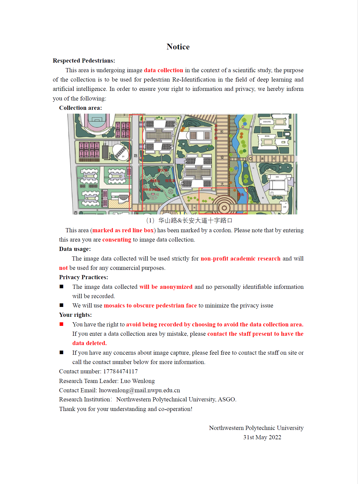
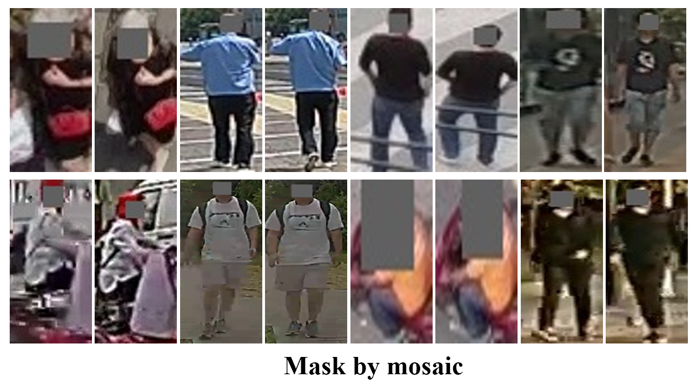
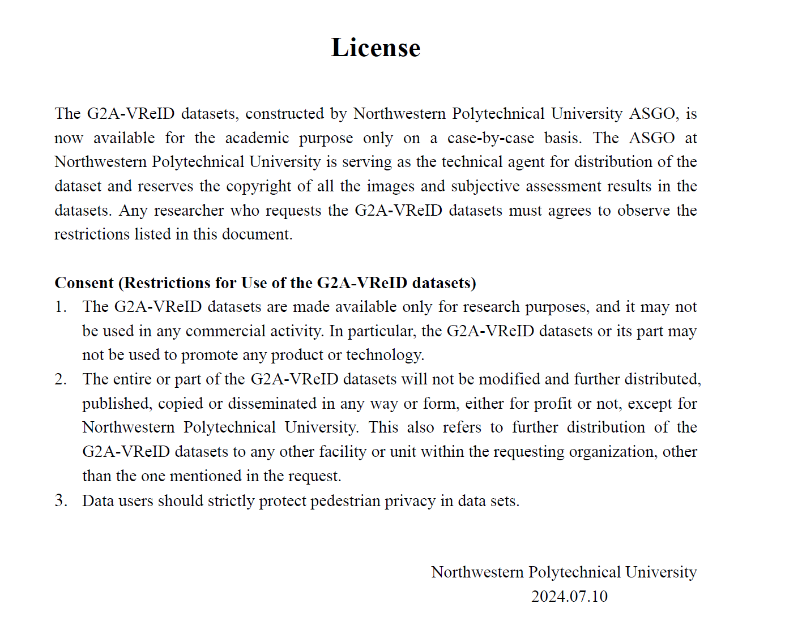

## G2A-VReID

### Introduction
G2A-VReID is a large-scale video-based pedestrain Re-Identification datasets, constructed by National Engineering Laboratory for Integrated 
Aero-Space-Ground-Ocean (ASGO) Big Data Application Technology. G2A-VReID consists of 2,788 person IDs and 185,907 images, 
corresponding to 5,576 tracklets. The number of identities is significantly higher than most of existing datasets. To
best of our knowledge, G2A-VReID is the first dataset for video ReID under Ground-to-Aerial scenarios. 
G2A-VReID dataset has the following characteristics: 
1) Drastic view changes; 
2) Large number of annotated identities;
3) Rich outdoor scenarios;
4) Huge difference in resolution.

### Privacy Protection
We try our best to protect the privacy of pedestrians from the following aspects:
1) we make our best efforts to inform pesdestrains about data collection, 
cordons are used to mark data collection areas and notifications (including ) are 
post near the sites in collection process. 

2) To further minimize privacy risks, 
we use mosaic mask the clear face information. Sepecially, we construct a 
face detection model (FDM) based on YOLOv5, which are trained on 
both widerface-m and darkface-m datasets. Then, the FDM is empoly to mark out 
clear face of pedestrains, and the masking them by mosaic (RGB:[96, 96, 96]). Meanwhile, 
10 experienced annotators are employed to check for missing detection images 
and mask them by manual.

3) Finally, the dataset will be licensed for non-profit academic 
research only, any researcher who requests the G2A-VReID dataset must sign agreement 
and agrees to observe the restrictions. 


### Request For G2A-VReID
The Agreement is available at [link](https://drive.google.com/file/d/1YlGf1pGWNbiE_oS-HfZIPBx4BjtHDUFU/view?usp=sharing), please download the file and read all agreements carefully. 
Sign the relevant consent forms and send the agreement to szzhang@nwpu.deu.cn, 
dcheng@xidian.edu.cn or luowenlong@mail.nwpu.edu.com.
We will get back to you with the dataset download link as soon as we review the Agreement.

### Citaion
```
@inproceedings{vsla-clip,
 author = {S. Zhang and W. Luo and D. Cheng and Q. Yang and L. Ran and Y. Xing and Y. Zhang},
 title  = {Cross-Platform Video Person ReID: A New Benchmark Dataset and Adaptation Approach},
 year   = {2024},
 booktitle = {ECCV}
}
```
```
